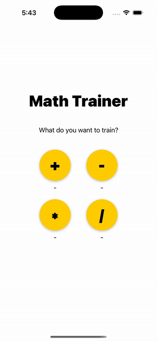
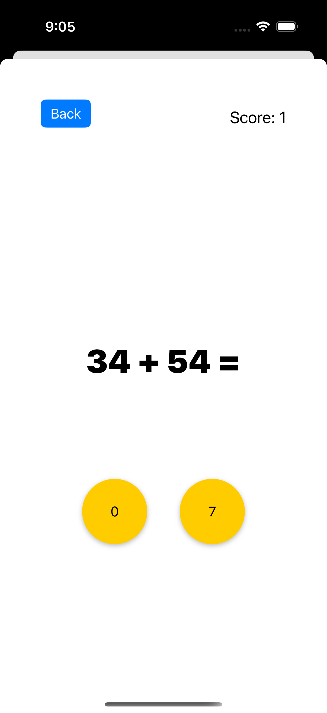
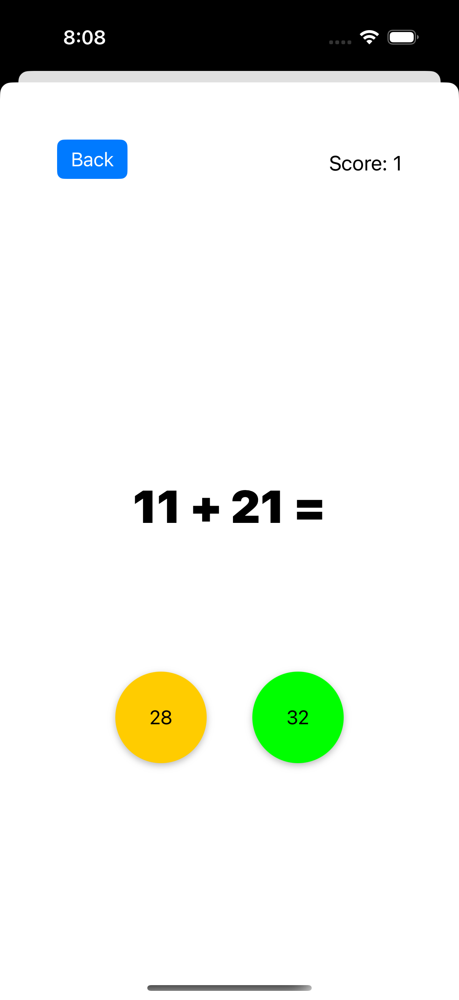
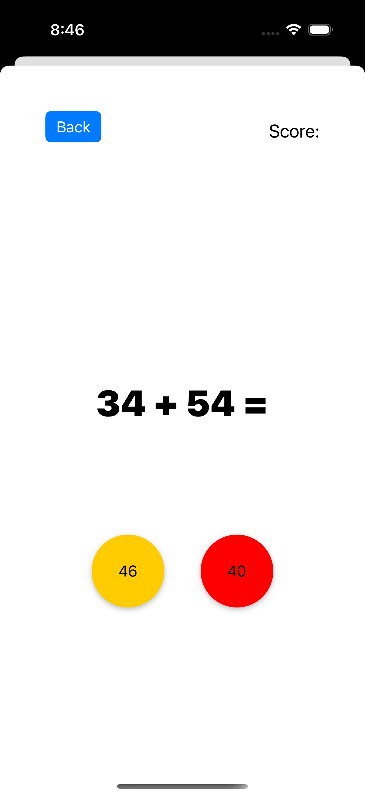
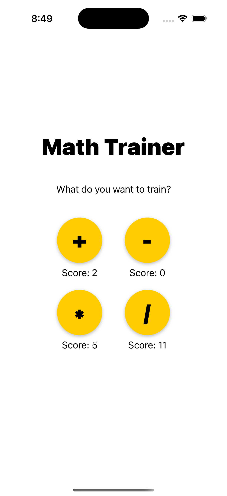

# 📱 Math Trainer — Fun and Interactive Math Practice

Math Trainer is an iOS app designed to help users of all ages improve their mental arithmetic skills in a fun and engaging way.

---

## 🚀 Features

- ➕ Practice Addition, Subtraction, Multiplication, and Division  
- 🧠 Smart Scoring — earn points for each correct answer  
- 🎯 Instant Feedback:
- ✅ Correct answers: buttons turn green  
- ❌ Incorrect answers: buttons turn red  
- 🏁 Final Score Screen — view your total score at the end of each session  

---

## 🎞 Demo

  

---

## 📸 Screenshots

| 🧮 Practice | ✅ Correct | ❌ Incorrect | 🏁 Final Score |
|------------|------------|--------------|----------------|
|    |  |  |  |

---

## 🛠 Built With

- Swift — programming language  
- Xcode — development environment  
- UIKit — interface framework  
- 🎯 Custom logic for point system and real-time feedback  
